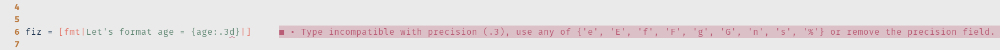

# PyF

*PyF* is a Haskell library for string interpolation and formatting.

*PyF* exposes a quasiquoter `f` which introduces string interpolation and formatting with a mini language inspired from printf and Python.

# Quick Start

```haskell
>>> import PyF

>>> name = "Dave"
>>> age = 54

>>> [fmt|Person's name is {name}, age is {age}|]
"Person's name is Dave, age is 54"
```

The formatting mini language can represent:

- Numbers with different representations (fixed point, general representation, binary, hexadecimal, octal)
- Padding, with the choice of padding char, alignment (left, right, around, between sign and number)
- Sign handling, to display or not the `+` for positive number
- Number grouping
- Floating point representation
- The interpolated value can be any Haskell expression.

You will need the extension `QuasiQuotes`, enable it with `{-# LANGUAGE QuasiQuotes #-}` in top of your source file or with `:set -XQuasiQuotes` in your `ghci` session. `ExtendedDefaultRules` and `OverloadedStrings` may be more convenient.

Expression to be formatted are referenced by `{expression:formattingOptions}` where `formattingOptions` follows the [Python format mini-language](https://docs.python.org/3/library/string.html#formatspec). It is recommended to read the python documentation, but the [Test file](https://github.com/guibou/PyF/blob/main/test/Spec.hs) as well as this readme contain many examples.

# More Examples

## Padding

Left `<` / Right `>` / Around `^` padding:

```haskell
>>> name = "Guillaume"
>>> [fmt|{name:<11}|]
"Guillaume  "
>>> [fmt|{name:>11}|]
"  Guillaume"
>>> [fmt|{name:|^13}|]
"||Guillaume||"
```

Padding inside `=` the sign

```haskell
>>> [fmt|{-3:=6}|]
"-    3"
```

## Float rounding

```haskell
>>> [fmt|{pi:.2}|]
"3.14"
```

## Binary / Octal / Hex representation (with or without prefix using `#`)

```haskell
>>> v = 31
>>> [fmt|Binary: {v:#b}|]
"Binary: 0b11111"
>>> [fmt|Octal: {v:#o}|]
"Octal: 0o37"
>>> [fmt|Octal (no prefix): {v:o}|]
"Octal (no prefix): 37"
>>> [fmt|Hexa (caps and prefix): {v:#X}|]
"Hexa (caps and prefix): 0x1F"
```

## Grouping

Using `,` or `_`.

```haskell
>>> [fmt|{10 ^ 9 - 1:,}|]
"999,999,999"
>>> [fmt|{2 ^ 32  -1:_b}|]
"1111_1111_1111_1111_1111_1111_1111_1111"
```

## Sign handling

Using `+` to display the positive sign (if any) or ` ` to display a space instead:

```haskell
>>> [fmt|{pi:+.3}|]
"+3.142"
>>> [fmt|{-pi:+.3} (Negative number)|]
"-3.142 (Negative number)"
>>> [fmt|{pi: .3}|]
" 3.142"
>>> [fmt|{-pi: .3} (Negative number)|]
"-3.142 (Negative number)"
```

## 0

Preceding the width with a `0` enables sign-aware zero-padding, this is equivalent to inside `=` padding with a fill char of `0`.

```haskell
>>> [f{10:010}|]
0000000010
>>> [f{-10:010}|]
-000000010
```

## Sub-expressions

First argument inside the curly braces can be a valid Haskell expression, for example:

```haskell
>>> [fmt|2pi = {2* pi:.2}|]
2pi = 6.28
>>> [fmt|tail "hello" = {tail "hello":->6}|]
"tail \"hello\" = --ello"
```

However the expression must not contain `}` or `:` characters.

## Combined

Most options can be combined. This generally leads to totally unreadable format string ;)

```haskell
>>> [fmt|{pi:~>5.2}|]
"~~3.14"
```

## Multi-line strings

You can ignore a line break with `\` if needed. For example:

```haskell
[fmt|\
- a
- b\
|]
```

Will returns `-a\n-b`. Note how the first and last line breaks are ignored.

## Arbitrary value for precision and padding

The precision and padding width fields can be any Haskell expression (including variables) instead of a fixed number:

```haskell
>>> [fmt|{pi:.{1+2}}|]
3.142
```

```haskell
>>> [fmt|{1986:^{2 * 10}d}|]
"        1986        "
```

# Output type

*PyF* aims at extending the string literal syntax. As such, it default to `String` type. However, if the `OverloadedString` is enabled, PyF will happilly generate `IsString t => t` instead. This means that you can use PyF to generate `String`, but also `Text` and why not `ByteString`, with all the caveats known to this extension.

```haskell
>>> [fmt|hello {pi.2}|] :: String
"hello 3.14"
```

# Custom types

PyF can format three categories of input types:

- Floating. Using the `f`, `g`, `e`, ... type specifiers. Any type instance of `RealFloat` can be formated as such.
- Integral. Using the `d`, `b`, `x`, `o`, ... type specifiers. Any type instance of `Integral` can be formated as such.
- String. Using the `s` type specifier. Any type instance of `PyFToString` can be formated as such.

See `PyF.Class` if you want to create new instances for the `PyFToString` class.

By default, if you do not provide any type specifier, PyF uses the `PyFClassify` type class to decide if your type must be formated as a Floating, Integral or String.

# Caveats

## Type inference

Type inference with numeric literals can be unreliable if your variables are too polymorphic. A type annotation or the extension `ExtendedDefaultRules` will help.

```haskell
>>> v = 10 :: Double
>>> [fmt|A float: {v}|]
A float: 10
```

## Error reporting

Template haskell is generally known to give developers a lot of
frustration when it comes to error message, dumping an unreadable
piece of generated code.

However, in PyF, we took great care to provide clear error reporting, this means that:

- Any parsing error on the mini language results in a clear indication of the error, for example:

```haskell
foo = [fmt|{age:.3d}|]
```

```
File.hs:77:19: error:
  |
1 | {age:.3d}
  |        ^
Type incompatible with precision (.3), use any of {'e', 'E', 'f', 'F', 'g', 'G', 'n', 's', '%'} or remove the precision field.
```

Note: error reporting uses the native GHC error infrastructure, so they will correctly appear in your editor (using [HLS](https://github.com/haskell/haskell-language-server)), for example:

  

- Error in variable name are also readable:

```haskell
test/SpecUtils.hs:81:33: error:
    • Variable not found: chien
    • In the quasi-quotation: [fmt|A missing variable: {chien}|]
   |
81 | fiz = [fmt|A missing variable: {chien}|]
   |                                 ^^^^^
```

- However, if the interpolated name is not of a compatible type (or
  too polymorphic), you will get an awful error:

```haskell
>>*> [fmt|{True:d}|]

<interactive>:80:10: error:
    • No instance for (Integral Bool)
        arising from a use of ‘PyF.Internal.QQ.formatAnyIntegral’
...
```

- There is also one class of error related to alignement which can be triggered, when using alignement inside sign (i.e. `=`) with string:

```haskell
*PyF PyF.Internal.QQ> [fmt|{"hello":=10}|]

<interactive>:89:10: error:
    • String Cannot be aligned with the inside `=` mode
...
```

- Finally, if you make any type error inside the expression field, you are on your own, you'll get an awful error in the middle of the generated template Haskell splice.

```haskell
>>> [fmt|{3 + pi + "hello":10}|]

<interactive>:99:10: error:
    • No instance for (Floating [Char]) arising from a use of ‘pi’
    ...
```

## Custom Delimiters

If `{` and `}` does not fit your needs, for example if you are formatting a lot of json, you can use custom delimiters. All quasi quoters have a parametric form which accepts custom delimiters. Due to template haskell stage restriction, you must define your custom quasi quoter in an other module.

For example, in `MyCustomDelimiter.hs`:

```haskell
module MyCustomQQ where

import Language.Haskell.TH.Quote

import PyF

myCustomFormatter :: QuasiQuoter
myCustomFormatter = mkFormatter "fmtWithDelimiters" (fmtConfig {
  delimiters = ('@','!')
  })
```

Later, in another module:

```haskell
import MyCustomQQ

-- ...

[myCustomFormatter|pi = @pi:2.f!|]
```

Escaping still works by doubling the delimiters, `@@!!@@!!` will be formatted as `@!@!`.

Have a look at `PyF.mkFormatter` for all the details about customization.

## Difference with the Python Syntax

The implementation is unit-tested against the reference python implementation (python 3.6.4) and should match its result. However some formatters are not supported or some (minor) differences can be observed.

### Not supported

- Number `n` formatter is not supported. In python this formatter can format a number and use current locale information for decimal part and thousand separator. There is no plan to support that because of the impure interface needed to read the locale.
- Python support sub variables in the formatting options in every places, such as `{expression:.{precision}}`. We only support it for `precision` and `width`. This is more complexe to setup for others fields.
- Python literal integers accepts binary/octal/hexa/decimal literals, PyF only accept decimal ones, I don't have a plan to support that, if you really need to format a float with a number of digit provided as a binary constant, open an issue.
- Python support adding custom formatters for new types, such as date. This may be really cool, for example `[fmt|{today:%Y-%M-%D}`. I don't know how to support that now.

### Difference

- General formatters *g* and *G* behaves a bit differently. Precision influence the number of significant digits instead of the number of the magnitude at which the representation changes between fixed and exponential.
- Grouping options allows grouping with an `_` for floating point, python only allows `,`.
- Custom delimiters

# Build / test

Should work with `stack build; stack test`, and with `cabal` and (optionally) `nix`:

```shell
nix-shell # Optional, if you use nix
cabal new-build
cabal new-test
```

There are a few available shells for you.

- `nix-shell` is the default, current GHC version with language server available.
- `nix-shell ./. -A pyf_xx.shell` is another GHC version (change `xx`) without language server.
- `nix-shell ./. -A pyf_xx.shell_hls` is another GHC version (change `xx`) with language server.

We also provide a few utility functions:

- `nix-build ./ -A hlint` will check hlint.
- `nix-shell ./ -A ormolu-fix` will format the codebase.

# Library note

`PyF.Formatters` exposes two functions to format numbers. They are type-safe (as much as possible) and comes with a combination of formatting options not seen in other formatting libraries:

```haskell
>>> formatIntegral Binary Plus (Just (20, AlignInside, '~')) (Just (4, ',')) 255
"+~~~~~~~~~~1111,1111"
```

# GHC compatibility

This library is tested in CI with ghc 8.6 to 9.2.

# Conclusion

Don't hesitate to make any suggestion, I'll be more than happy to work on it.

# Hacking

Everything works with nix and flakes. But you can also try with manual cabal / stack if you wish.

- `nix develop` will open a shell with everything you need to work on PyF, including haskell-language-server. It may be a bit too much, so you can instead:
- `nix develop .#pyf_XY` opens a shell with a specific GHC version and without haskell-language-server. That's mostly to test compatibility with different GHC version or open a shell without HLS if you are in a hurry. Replace `pyf_XY` by `pyf_86`, `pyf_88`, `pyf_810`, `pyf_90` or `pyf_92`.

Once in the shell, use `cabal build`, `cabal test`, `cabal repl`.

There is a cachix available, used by CI, and already configured in flakes. You can manually run `cachix use guibou` if you want.

You can locally build and test everything using:

- `nix build .#pyf_all`.

Don't hesitate to submit a PR not tested on all GHC versions.

## Formatting

The codebase is formatted with `ormolu`. Please run:

- `nix run .\#run-ormolu`

Before submitting.
