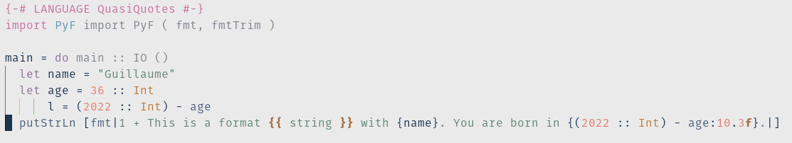

# Syntax highlighting with treesitter

With this grammar for treesitter, you can get PyF syntax highlighting into your
treesitter compatible editor, such as nvim or emacs.


## Installation

## Building the grammar

Go into this directory, start `nix develop` (Or install `tree-sitter CLI`) and then:

```bash
$ tree-sitter generate
```

You can also experiment with `tree-sitter parse example-file`

```sexp
(source_file [0, 0] - [1, 0]
  (text [0, 0] - [0, 19])
  (escape [0, 19] - [0, 21])
  (text [0, 21] - [0, 27])
  (interpolation [0, 27] - [0, 48]
    (interpolation_content [0, 28] - [0, 47]))
  (text [0, 48] - [0, 49])
  (escape [0, 49] - [0, 51])
  (text [0, 51] - [0, 56])
  (interpolation [0, 56] - [0, 67]
    (interpolation_content [0, 57] - [0, 62])
    (format_string [0, 62] - [0, 66]
      (format_spec [0, 62] - [0, 66]
        (precision_dot [0, 63] - [0, 64])
        (precision [0, 64] - [0, 65])
        (type [0, 65] - [0, 66]))))
  (text [0, 67] - [0, 108])
  (interpolation [0, 108] - [0, 121]
    (interpolation_content [0, 109] - [0, 118])
    (format_string [0, 118] - [0, 120]
      (format_spec [0, 118] - [0, 120]
        (type [0, 119] - [0, 120]))))
  (text [0, 121] - [1, 0]))
```

### Neovim

You can use this documentation: [NVim documentation for adding parsers](https://github.com/nvim-treesitter/nvim-treesitter#adding-parsers).

I've added the following in my nvim lua configuration file, where `~/PyF/tree-sitter-pyf` points to this directory.

```lua
-- Install my own parser
local parser_config = require "nvim-treesitter.parsers".get_parser_configs()
parser_config.pyf = {
  install_info = {
    url = "~/PyF/tree-sitter-pyf", -- local path or git repo
    files = {"src/parser.c"},
    -- optional entries:
    branch = "main", -- default branch in case of git repo if different from master
    generate_requires_npm = false, -- if stand-alone parser without npm dependencies
    requires_generate_from_grammar = false, -- if folder contains pre-generated src/parser.c
  },
}
```

Then do `:TSInstall pyf` and you are good to go.

Then I've added the following files in my nvim configuration in `~/.config/nvim/after/queries/`:

- `haskell/highlights.scm`:

```sexp
(quasiquote_body) @string
```

It just change the quasiquote body so it looks like string content by default.
This is not mandatory, but that's nicer (from my point of view ;).

- `haskell/injections.scm`:

```sexp
(quasiquote
  ((quoter) @_quoter (#eq? @_quoter "fmt"))
  (quasiquote_body) @pyf
)

(quasiquote
  ((quoter) @_quoter (#eq? @_quoter "fmtTrim"))
  (quasiquote_body) @pyf
)
```

It says that `fmt` and `fmtTrim` should applieds the `pyf` parser.

- `pyf/injections.scm`

```sexp
(interpolation_content) @haskell
```

Here it says that the haskell expression should be formatted as `haskell`.

- `pyf/highlights.scm`

```sexp
(escape) @string.escape
(interpolation) @punctuation.special

(type) @string.escape
(width) @number
(precision) @number
```

And here it sets the colors for a few of the items in the format string, as well as special characters.
